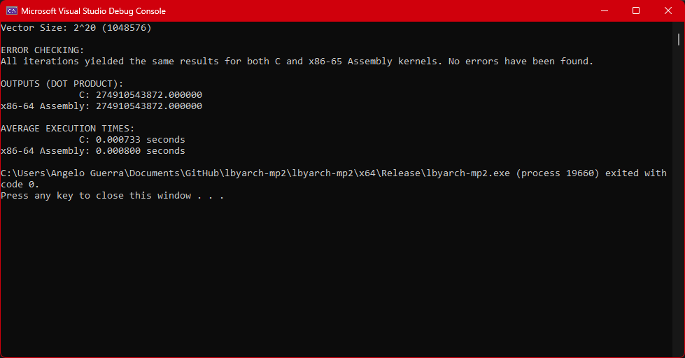

# LBYARCH Machine Project 2: x86-to-C Interface Programming

This project implements a kernel performing the dot product of two vectors both in C and x86-64 assembly with interfacing. A comparative analysis of the execution times of both kernels was also performed.

## Running the Program
1. Clone this repository: `git clone https://github.com/angelocguerra/lbyarch-mp2.git` or download the zip file of the project's latest release and navigate to the project directory
2. Open the `.sln` file in Visual Studio
3. Ensure that the `asmfunc.asm` file is configured with the appropriate settings in "Properties"
4. Run `main.c` with the selected configuration (Debug/Release)
5. Optional: you can opt to change the exponent of the vector size at Line 43 in `main.c`

## Comparative Analysis
### Debug Mode
| **Vector Size** | **C**      | **Assembly** | Which is Faster? | by?     |
|:---------------:|:----------:|:------------:|:----------------:|:-------:|
| $2^{20}$        | 0.002867s  | 0.000767s    | Assembly         | 373.79% |
| $2^{24}$        | 0.046267s  | 0.012667s    | Assembly         | 365.26% |
| $2^{30}$        | 2.909167s  | 0.803233s    | Assembly         | 362.18% |

The comparison between x86-64 Assembly and C kernel implementations, particularly in Debug mode, shows that Assembly consistently outperforms C in terms of execution time by 367% on an average across various vector sizes. Specifically at vector sizes of $2^{20}$, $2^{24}$, and $2^{30}$, Assembly demonstrates runtimes of 0.000767 seconds, 0.012667 seconds, and 0.803233 seconds, respectively, compared to C's longer times of 0.002867 seconds, 0.046267 seconds, and 2.909167 seconds. The superiority of Assembly's performance can be attributed to its lower-level nature, which allows for more efficient code execution with reduced overhead. Moreover, the slower performance of C in Debug mode is attributed to its higher-level abstraction and the overhead incurred by debug features, contrasting with the direct optimization capabilities of Assembly.

### Release Mode
| **Vector Size** | **C**      | **Assembly** | Which is Faster? | by?     |
|:---------------:|:----------:|:------------:|:----------------:|:-------:|
| $2^{20}$        | 0.000733s  | 0.000800s    | C                | 109.14% |
| $2^{24}$        | 0.012567s  | 0.012733s    | C                | 101.32% |
| $2^{30}$        | 0.795000s  | 0.801533s    | C                | 100.82% |

In release mode, the comparison between x86-64 Assembly and C implementations reveals that C shows faster execution times across various vector sizes. For vector sizes of $2^{20}$, $2^{24}$, and $2^{30}$, the average run times in C were 0.000733 seconds, 0.012567 seconds, and 0.795000 seconds, respectively, while the corresponding times in Assembly were 0.000800 seconds, 0.012733 seconds, and 0.801533 seconds. This indicates that C outperforms Assembly by 103% on an average for these respective vector sizes. The performance gain in C can be attributed to the optimizations applied in release mode which enhances its speed and debug features turned off which costs additional overhead compared to Assembly. Despite Assembly's potential for further optimizations (in terms of registers and instructions used), the speed optimizations inherent to release mode in C allow it to surpass Assembly in terms of execution time efficiency.

## Screenshots of Program Output

To ensure the correctness of both the outputs of the C and x86-64 Assembly kernel, additional error checking measures were implemented to check if both kernels produced the same output and have the same logic implementation across different vector sizes. Once an iteration where the outputs encountered for the two kernels do not match, the `error_flag` variable will be set to 1 and an error message shall be displayed accordingly, indicating there has been an error in the implementation of either kernels. Else, if the `error_flag` has not been set all throughout the iterations, a pass message shall be displayed to indicate the code's correctness.

### Debug Mode Outputs

#### $2^{20}$
</img>
#### $2^{24}$
</img>
#### $2^{30}$
</img>

### Release Mode Outputs

#### $2^{20}$
</img>
#### $2^{24}$
</img>
#### $2^{30}$
</img>

## Group Members
Section: S15
- Jose Maria Angelo Guerra
- Trisha Alissandra Sayo
